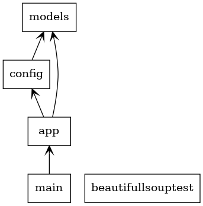
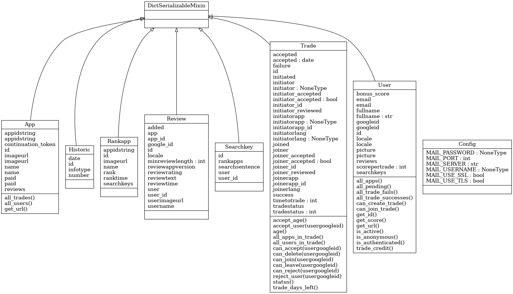

# 1 Trade A Rate  

I built this because I needed to rate apps but kept hitting the “review ban” on the Play Store—so I made a simple peer-to-peer rating exchange. You list your app, find a match, both agree, and each rates the other’s app within two weeks. Points accrue on successful trades; more points = more pending trades.  

No trust, no middleman—just direct trades.  

# 2 Structure  

Standard Flask layout, with a few extras:  

- `/alembic` — DB migrations  
- `/assets` — CSS, JS, images  
- `/cronscripts` — Play Store scrapers (runs hourly via cron)  
- `/dist` — Production-ready templates (compiled)  
- `/lib` — Shared helper classes  
- `/tools` — Dev utilities: fake DB populator, DB cleanup, etc.  
- `/translations` — i18n files  

# 3 How to run  

Needs `pipenv`. Set up secrets (at minimum: Google OAuth2, reCAPTCHA, SMTP).  

Create `run.sh`:  

```bash
export FLASK_APP=app
export FLASK_ENV=development
export SECRETKEY='your-secret'
export SECRETPASS='your-pass'
export CLIENTID='your-oauth-id'
export CLIENTSECRET='your-oauth-secret'
export RECAPCHASITEKEY='your-site-key'
export RECAPCHASSECRET='your-secret-key'
export MAILUSERNAME='your-smtp-user'
export MAILPASSWORD='your-smtp-pass'

flask run --host=0.0.0.0
```  

Make it executable: `chmod +x run.sh`, then `./run.sh`.  

Production? Deployment notes are out of scope here—this runs on a single VM for now.  

# 4 Class diagram  

  
  

# 5 Dependencies  

`sqlalchemy`, `flask`, `requests`, `flask-login`, `flask-mail`, `cerberus`,  
`flask-cachecontrol`, `sqlalchemy-utils`, `bs4`, `google-play-scraper`,  
`toml`, `html5lib`, `lxml`, `cssselect`, `setuptools`, `authlib`, `pylint`